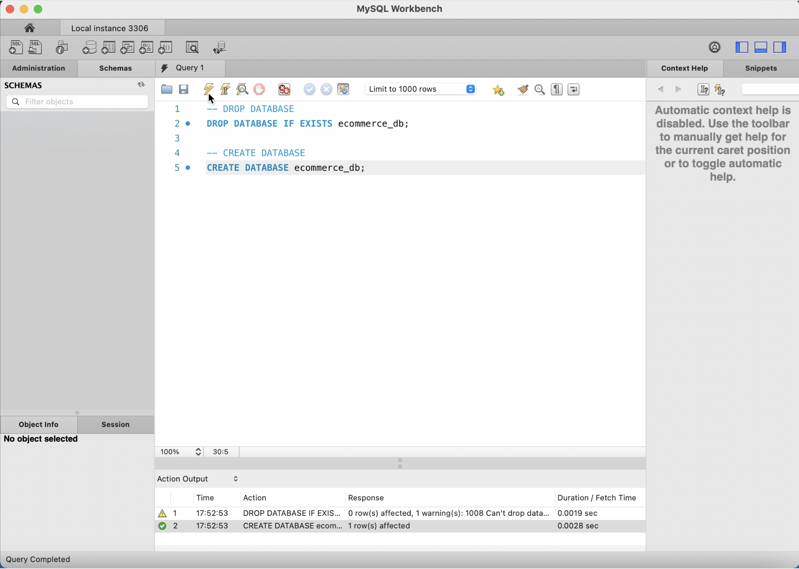
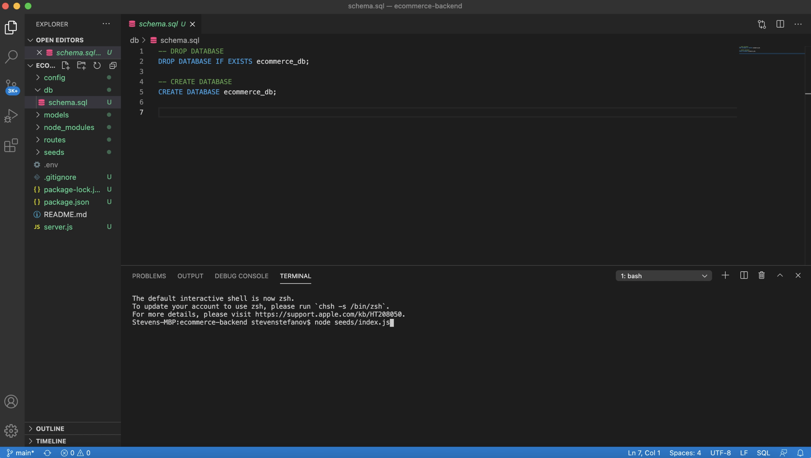
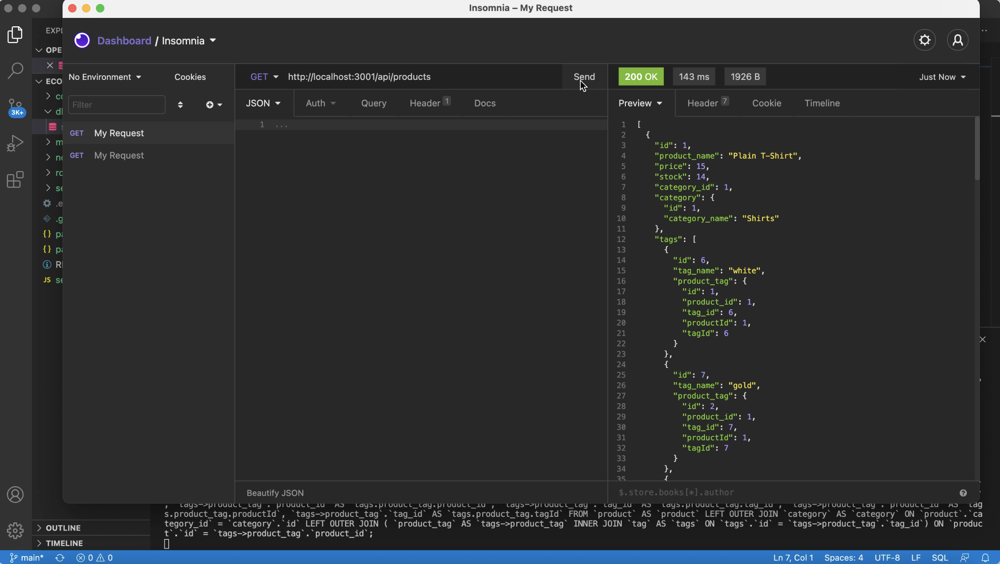
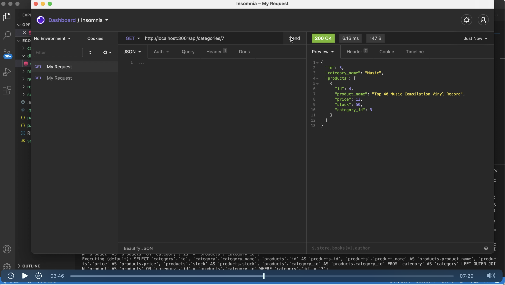
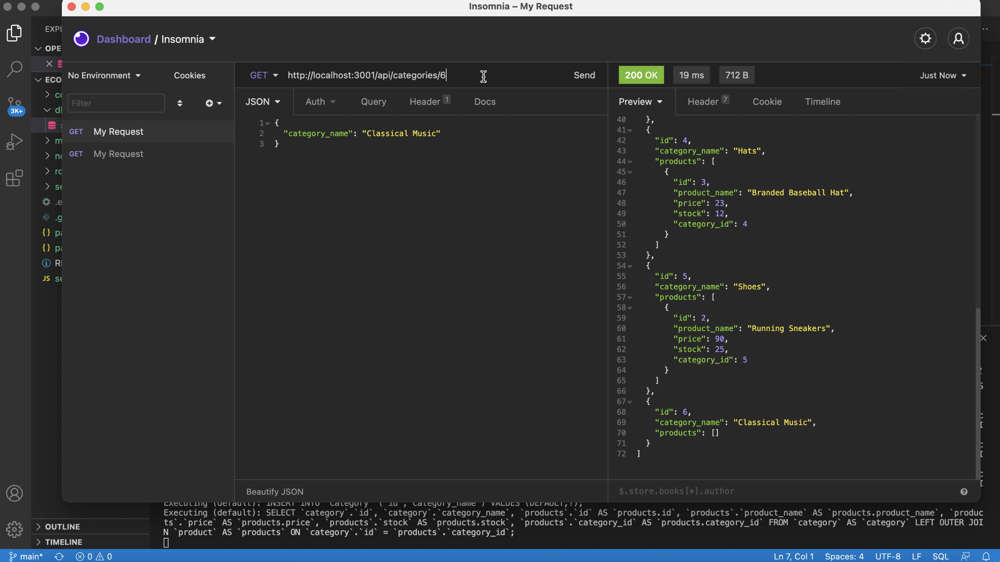
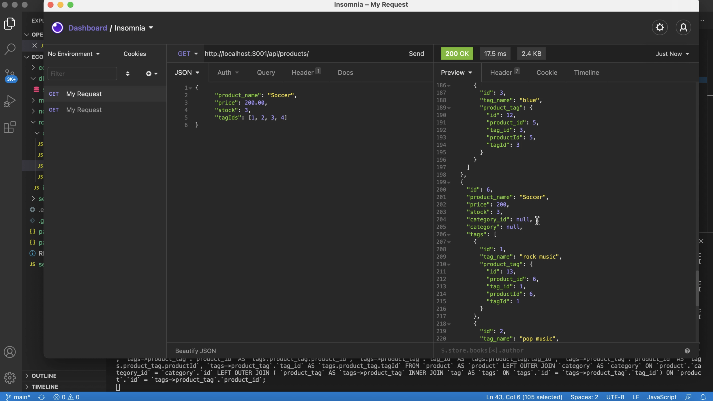
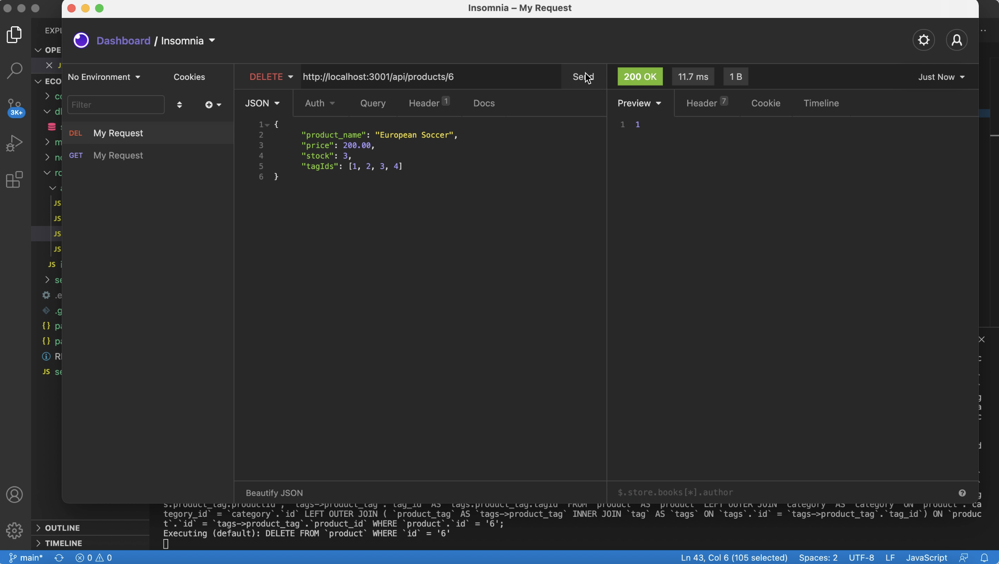

# E-Commerce Backend

## Project Description

This is a backend application that uses **JavaScript**, **MySQL**, **Express.js**, and **Sequelize** to manage an e-commerce store's inventory.

## Project Screenshots

## Project Video

You can see a video demo of the project here: [Employee Management System Video](https://www.youtube.com/watch?v=RPw4ULJDeeg)

## Background

I've always entertained the thought of creating an e-commerce store for myself but the only ways I knew how to do it were though methods such as Squarespace or Wordpress. However, I wanted to learn how the backend works so this project was very educational and interesting to me.

## Learnings

Throughout this project I learned a lot more about how to use **Sequelize** and how to set up routes for the different APIs.

## Challenges

It was challenging to test each of the **CRUD** requests for each of the tables in the database. I ran into a few errors and had to troubleshoot throught the code to see what the issues were. The issues ended up being a few names not being camelbacked.

## Updates

This project had some starter code such as the server and some of the index files and the models. All the routes for categories, products and tags were all created afterwards.

## Instalation

This project is ran exclusively through the command line. Save the project to your local computer. Navigate inside the project folder and install all necessary dependencies by typing:

``npm init``

followed by:

``npm install``

Open db/schema.sql, copy the code, paste into MySQL Workbench to set up your database. Back in your command line, run the seed file by typing:

``node seeds/index.js``

Once that has fully run, type:

``node server``

in your the CLI and press the Enter button to launch the server and connect to the database.

## Usage

Once the database is set up and the server is running, use a program like **Insomnia** to manipulate data on your backend. Navigate to http://localhost:3001/api/ and then add **"products"**, **"categories"**, or **"tags"** depending on what information you want. This will allow you to pull all the data from those categories or to post new data. Add an additional "/" with an **id** to select a single object which can be **read**, **updated** or **deleted**.

## Credits

Thank you to Columbia's Full-Stack Web Developer bootcamp for all the assistance and for teaching me all that I have learned.

## Licence

Copyright (c) 2021 Steven Stefanov

Permission is hereby granted, free of charge, to any person obtaining a copy
of this software and associated documentation files (the "Software"), to deal
in the Software without restriction, including without limitation the rights
to use, copy, modify, merge, publish, distribute, sublicense, and/or sell
copies of the Software, and to permit persons to whom the Software is
furnished to do so, subject to the following conditions:

The above copyright notice and this permission notice shall be included in all
copies or substantial portions of the Software.

THE SOFTWARE IS PROVIDED "AS IS", WITHOUT WARRANTY OF ANY KIND, EXPRESS OR
IMPLIED, INCLUDING BUT NOT LIMITED TO THE WARRANTIES OF MERCHANTABILITY,
FITNESS FOR A PARTICULAR PURPOSE AND NONINFRINGEMENT. IN NO EVENT SHALL THE
AUTHORS OR COPYRIGHT HOLDERS BE LIABLE FOR ANY CLAIM, DAMAGES OR OTHER
LIABILITY, WHETHER IN AN ACTION OF CONTRACT, TORT OR OTHERWISE, ARISING FROM,
OUT OF OR IN CONNECTION WITH THE SOFTWARE OR THE USE OR OTHER DEALINGS IN THE
SOFTWARE.